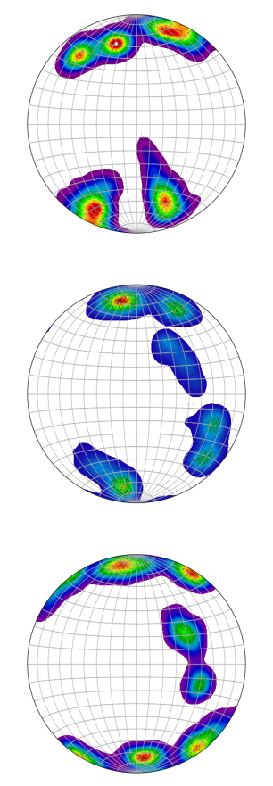

Synthetic Fabric
----------------

This recipe replicates 3 fabrics from Figure 7 in `Morgan E. Monz et al. <https://tc.copernicus.org/articles/15/303/2021/>`_. The parameters were tuned somewhat heuristically to match the figure. 

The *orientation_tensor* module is deprecated and has been replaced with the `fabricsynth <https://github.com/UMainedynamics/SeidarT/blob/main/src/seidart/routines/fabricsynth.py>`_ module. This was done to expand the capability of modeling more complex fabrics. This example computes multipole fabrics, but a single pole fabric can be built in the same manner by changing the inputs. 

